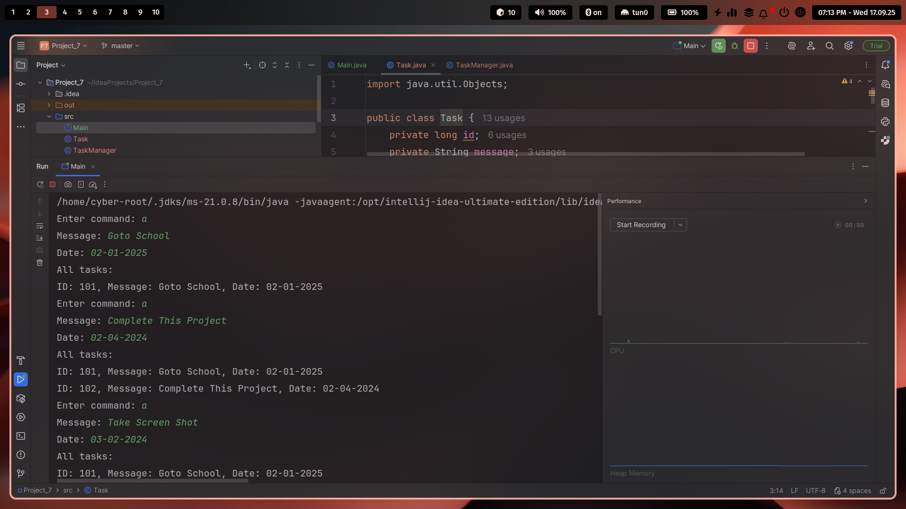
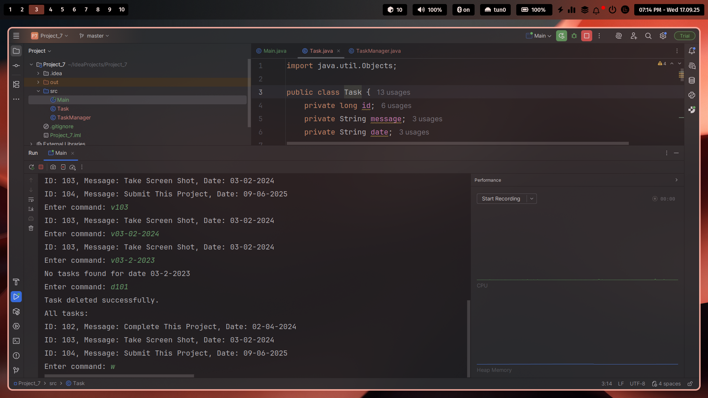

# Project_7 on Console To-Do List
## Title: Console To-Do List


# Summary:

## Create a console application in Java to simulate a todo application. Here users should be able to add, view, and delete tasks via console command.


# About Structure:

  ###  Each task should have the following properties:

###     id: of type long. It must be unique and should not be taken from the user during input

###     message: of type string

###      date: of type string of format dd/MM/yyyy

###   The program should be interactive and should not terminate.

# Input Details:

## There can be 4 types of input:

   ### a: User input “a” in the console. The program should add a new task after taking the message and date as input

### v<id>: The program should show the task associated with the id

### v<date>: The program should show all the tasks at that date

###  d<id>: The program should delete the task associated with the id

# Example Simulation:

```

Enter command: a

    Message: Scrum meeting

    Date       : 14/09/2025

// Add the task then show all tasks


Enter command: v101

// Show the task having id = 101


Enter command: v14/09/2025

// Show all the tasks at date 14/09/2025


Enter command: v112

// Show the task having id = 112


Enter command: d112

// Delete the task having id = 112, then show all available tasks


….. continue ….

```
# Constraints:

  ###  Use a class named Task for managing a single task (10%)

### Use a class named TaskManager for adding, deleting, searching, and others operations (10%)

### For add, and delete operation, you must show all the available tasks (10%)

###  id for each task during creation should not be taken via input (10%)

###   Use Set implementation like HashSet or TreeSet for storing the tasks (20%)

###  Use Map for doing the search operation using id or date (10%)

## Screenshots

### Application Running


### Task Operations


